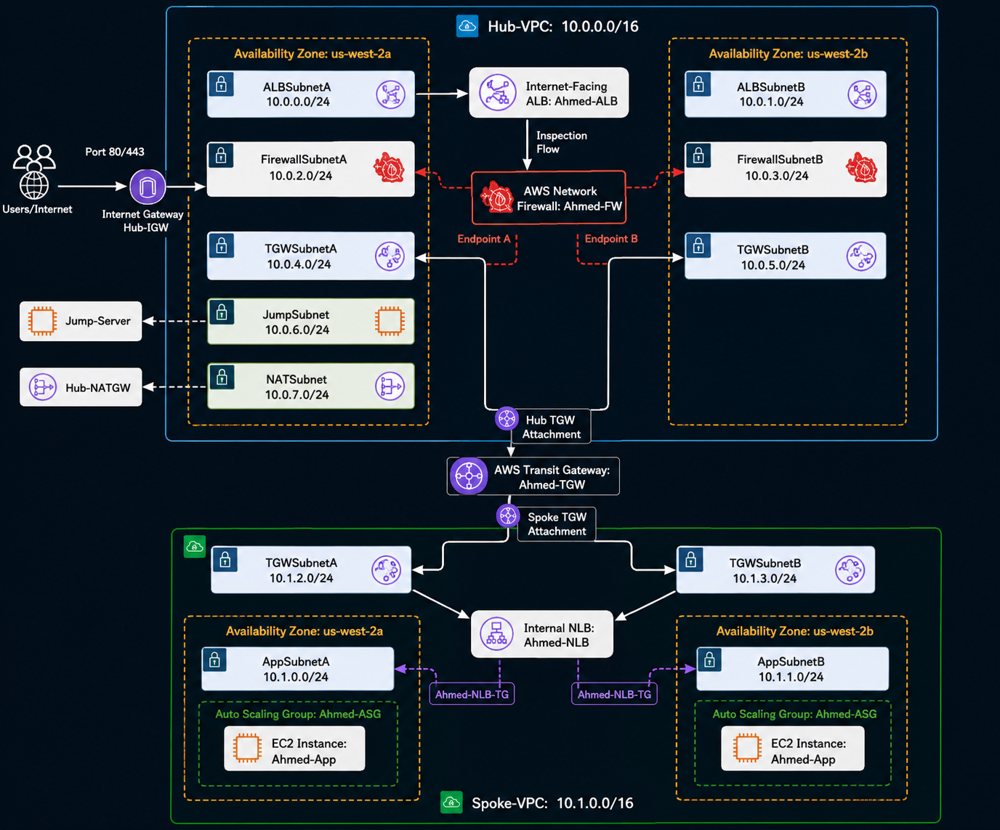

# 🚀 AWS Secure Hub-and-Spoke Architecture using AWS CloudFormation

A production-style AWS networking project that implements a secure **Hub-and-Spoke architecture** using **Infrastructure as Code (IaC)** with **AWS CloudFormation**.

The architecture centralizes security inspection using **AWS Network Firewall** inside a Hub VPC while hosting application workloads inside a separate Spoke VPC connected through **AWS Transit Gateway (TGW)**.

Incoming internet traffic is protected by **Amazon CloudFront** and **AWS WAF**, then forwarded to an **Internet-facing Application Load Balancer (ALB)**. The traffic is inspected by **AWS Network Firewall**, routed through **Transit Gateway**, forwarded to an **Internal Network Load Balancer (NLB)**, and finally distributed across EC2 instances running inside an **Auto Scaling Group**.

# AWS Secure Hub-and-Spoke Architecture

# AWS Secure Hub-and-Spoke Architecture



---

# 📖 Project Overview

This project demonstrates how to build a secure, scalable, and highly available AWS network architecture using CloudFormation.

The entire infrastructure is deployed using Infrastructure as Code except for two AWS limitations:

- Registering the Network Load Balancer ENI private IP addresses inside the ALB IP Target Group.
- Creating Route Table entries that reference the AWS Network Firewall Gateway Load Balancer Endpoints (GWLB Endpoints), since these endpoint IDs are generated dynamically after firewall deployment.

---

# 🎯 Project Objectives

- Build a secure Hub-and-Spoke architecture.
- Centralize network inspection using AWS Network Firewall.
- Separate networking and application workloads.
- Implement highly available networking across multiple Availability Zones.
- Deploy infrastructure using AWS CloudFormation.
- Protect public traffic using AWS WAF.
- Accelerate content delivery using Amazon CloudFront.
- Automatically scale application servers using Auto Scaling.

---

# 🏗 Architecture

```

Internet Users
│
▼
Amazon CloudFront
│
▼
AWS WAF
│
▼
Internet Gateway
│
▼
Application Load Balancer (ALB)
│
▼
AWS Network Firewall
│
▼
AWS Transit Gateway
│
▼
Internal Network Load Balancer (NLB)
│
▼
Auto Scaling Group
├───────────────┐
│               │
EC2             EC2

```

---

# 🌐 Network Design

The infrastructure consists of two isolated Virtual Private Clouds (VPCs):

- **Hub VPC** – Hosts all shared networking and security services.
- **Spoke VPC** – Hosts the application workload.

The two VPCs communicate through **AWS Transit Gateway**, allowing centralized routing and traffic inspection.

---

# Hub VPC

**Name**

```
Hub-VPC
```

**CIDR Block**

```
10.0.0.0/16
```

The Hub VPC is responsible for:

- Internet Connectivity
- Traffic Inspection
- Centralized Routing
- Bastion (Jump) Access
- NAT Services

## Hub VPC Subnets

| Subnet          | CIDR        | Availability Zone | Purpose                    |
| --------------- | ----------- | ----------------- | -------------------------- |
| ALBSubnetA      | 10.0.0.0/24 | us-west-2a        | Internet-facing ALB        |
| ALBSubnetB      | 10.0.1.0/24 | us-west-2b        | Internet-facing ALB        |
| FirewallSubnetA | 10.0.2.0/24 | us-west-2a        | AWS Network Firewall       |
| FirewallSubnetB | 10.0.3.0/24 | us-west-2b        | AWS Network Firewall       |
| TGWSubnetA      | 10.0.4.0/24 | us-west-2a        | Transit Gateway Attachment |
| TGWSubnetB      | 10.0.5.0/24 | us-west-2b        | Transit Gateway Attachment |
| JumpSubnet      | 10.0.6.0/24 | us-west-2a        | Jump Server                |
| NATSubnet       | 10.0.7.0/24 | us-west-2a        | NAT Gateway                |

---

## Resources inside Hub VPC

### Internet Gateway

Provides internet connectivity for the Hub VPC.

---

### Application Load Balancer

Resource Name

```
Ahmed-ALB
```

The ALB receives all public HTTP traffic and forwards it to the AWS Network Firewall for inspection.

Characteristics

- Internet Facing
- Layer 7 Load Balancer
- Deployed across two Availability Zones
- Uses IP Target Group

---

### AWS Network Firewall

Resource Name

```
Ahmed-FW
```

The firewall performs centralized stateful inspection before traffic is allowed to enter the application environment.

Deployment

- Firewall Endpoint in FirewallSubnetA
- Firewall Endpoint in FirewallSubnetB

Policy

```
Stateful
```

Inspection Type

```
Stateful Inspection
```

---

### Transit Gateway Attachment

Resource Name

```
Ahmed-Hub-TGW-Attach
```

Attached Subnets

- TGWSubnetA
- TGWSubnetB

---

### Jump Server

Resource Name

```
Jump-Server
```

Purpose

- Administrative SSH Access
- Secure access to private EC2 instances

---

### NAT Gateway

Provides outbound internet access for private application instances.

---

# Spoke VPC

**Name**

```
Spoke-VPC
```

CIDR

```
10.1.0.0/16
```

The Spoke VPC hosts the application infrastructure.

It has no direct internet exposure.

All traffic must pass through:

- Transit Gateway
- AWS Network Firewall

before reaching the application.

---

## Spoke VPC Subnets

| Subnet     | CIDR        | Availability Zone | Purpose                    |
| ---------- | ----------- | ----------------- | -------------------------- |
| AppSubnetA | 10.1.0.0/24 | us-west-2a        | Application Servers        |
| AppSubnetB | 10.1.1.0/24 | us-west-2b        | Application Servers        |
| TGWSubnetA | 10.1.2.0/24 | us-west-2a        | Transit Gateway Attachment |
| TGWSubnetB | 10.1.3.0/24 | us-west-2b        | Transit Gateway Attachment |

---

## Resources inside Spoke VPC

### Internal Network Load Balancer

Resource Name

```
Ahmed-NLB
```

Characteristics

- Internal
- Layer 4 Load Balancer
- Cross-Zone Enabled
- TCP Listener
- Instance Target Group

---

### Auto Scaling Group

Resource Name

```
Ahmed-ASG
```

Configuration

Minimum Capacity

```
2
```

Desired Capacity

```
2
```

Maximum Capacity

```
4
```

The Auto Scaling Group automatically registers instances inside the NLB Target Group.

---

### EC2 Instances

The application instances are deployed across two Availability Zones.

```
AZ-A

EC2 Instance

AZ-B

EC2 Instance
```

This ensures High Availability in case one Availability Zone becomes unavailable.

---

### Transit Gateway Attachment

Resource Name

```
Ahmed-Spoke-TGW-Attach
```

Attached Subnets

- TGWSubnetA
- TGWSubnetB

This attachment allows the Spoke VPC to communicate with the Hub VPC through AWS Transit Gateway.

---

# 🔀 Traffic Flow

The following section explains how traffic traverses the infrastructure from the internet to the application servers.

---

## 🌍 Incoming Traffic

```
Internet Users
        │
        ▼
Amazon CloudFront
        │
        ▼
AWS WAF
        │
        ▼
Internet Gateway
        │
        ▼
Application Load Balancer
        │
        ▼
AWS Network Firewall
        │
        ▼
AWS Transit Gateway
        │
        ▼
Internal Network Load Balancer
        │
        ▼
Auto Scaling Group
        │
        ▼
EC2 Application Instances
```

### Step 1 – Internet Access

Users access the application using the CloudFront Distribution.

CloudFront acts as the global edge network and forwards requests to the Application Load Balancer.

---

### Step 2 – AWS WAF Inspection

Before requests reach the application, AWS WAF evaluates them using managed rule groups.

Configured managed rules:

- Amazon IP Reputation List
- Common Rule Set
- Known Bad Inputs
- SQL Injection Rule Set

Any malicious request is blocked before reaching the ALB.

---

### Step 3 – Application Load Balancer

The internet-facing ALB receives valid HTTP requests.

The ALB forwards requests to its IP Target Group.

The registered IP targets are the private ENIs created by the Internal Network Load Balancer inside the Spoke VPC.

---

### Step 4 – AWS Network Firewall

All application traffic passes through AWS Network Firewall.

The firewall performs Stateful Inspection before allowing traffic to continue.

Firewall responsibilities:

- Inspect inbound traffic
- Inspect outbound traffic
- Allow only approved communication
- Block unauthorized connections

---

### Step 5 – AWS Transit Gateway

After inspection, traffic is forwarded through AWS Transit Gateway.

Transit Gateway provides centralized routing between the Hub and Spoke VPCs.

---

### Step 6 – Internal Network Load Balancer

The Internal NLB distributes traffic across application instances.

Configuration:

- Internal
- Layer 4
- TCP Listener
- Cross-Zone Enabled

---

### Step 7 – Auto Scaling Group

The NLB forwards traffic to the Auto Scaling Group Target Group.

The Auto Scaling Group automatically registers new EC2 instances with the NLB Target Group.

Application instances are distributed across two Availability Zones.

---

# 🔄 Outbound Traffic Flow

Application instances never access the Internet directly.

Outbound traffic follows the path below:

```
EC2 Instance
      │
      ▼
Internal NLB
      │
      ▼
Transit Gateway
      │
      ▼
AWS Network Firewall
      │
      ▼
NAT Gateway
      │
      ▼
Internet Gateway
      │
      ▼
Internet
```

This design ensures that all outbound traffic is inspected before leaving the AWS environment.

---

# 🔐 Administrative Access

Administrative access is isolated from application traffic.

```
Administrator
        │
        ▼
Internet
        │
        ▼
Internet Gateway
        │
        ▼
Jump Server
        │
        ▼
AWS Network Firewall
        │
        ▼
Transit Gateway
        │
        ▼
Private EC2 Instances
```

The Jump Server is the only administrative entry point.

Application servers do not have public IP addresses.

---

# 🛡 Security Architecture

The project follows a layered security model.

## Edge Security

- Amazon CloudFront
- AWS WAF

Purpose

- Global Edge Protection
- Request Filtering
- SQL Injection Protection
- XSS Protection
- IP Reputation Filtering

---

## Network Security

- AWS Network Firewall

Purpose

- Stateful Packet Inspection
- Centralized Traffic Inspection
- Secure Inter-VPC Communication

---

## Routing Security

- AWS Transit Gateway

Purpose

- Centralized Routing
- Hub-and-Spoke Connectivity

---

## Compute Security

Application instances are deployed inside private application subnets.

Security Groups allow only:

| Source      | Port | Purpose |
| ----------- | ---- | ------- |
| Hub VPC     | 80   | HTTP    |
| Hub VPC     | 443  | HTTPS   |
| Jump Subnet | 22   | SSH     |

No inbound internet access is allowed to EC2 instances.

---

# 🔥 AWS Network Firewall Rules

The firewall policy uses **Stateful Inspection**.

Traffic is explicitly allowed between trusted networks.

### Allowed Traffic

| Source            | Destination | Port |
| ----------------- | ----------- | ---- |
| Jump Subnet       | Spoke VPC   | 22   |
| Jump Subnet       | Spoke VPC   | 80   |
| ALB Subnets       | Spoke VPC   | 80   |
| ALB Subnets       | Spoke VPC   | 443  |
| Spoke VPC         | NAT Subnet  | 80   |
| Spoke VPC         | NAT Subnet  | 443  |
| Internal Networks | DNS         | 53   |

All other traffic is implicitly denied unless explicitly allowed.

---

# 🌐 High Availability

The solution is deployed across two Availability Zones.

Each critical component is deployed redundantly.

Components deployed in multiple AZs:

- Application Load Balancer
- AWS Network Firewall
- Transit Gateway Attachment
- Network Load Balancer
- Auto Scaling Group
- EC2 Instances

This ensures resilience against Availability Zone failures.

---

# 🚀 Deployment Order

The CloudFormation stacks must be deployed in the following order because each stack exports resources consumed by the next stack.

| Order | Template                 | Description                                       |
| ----- | ------------------------ | ------------------------------------------------- |
| 1     | 01-hub-vpc.yaml          | Creates the Hub VPC and networking resources      |
| 2     | 02-spoke-vpc.yaml        | Creates the Spoke VPC                             |
| 3     | 03-transit-gateway.yaml  | Creates Transit Gateway and VPC Attachments       |
| 4     | 04-network-firewall.yaml | Deploys AWS Network Firewall                      |
| 5     | 05-nlb.yaml              | Deploys Internal Network Load Balancer            |
| 6     | 06-alb.yaml              | Deploys Internet-facing Application Load Balancer |
| 7     | 07-launch-template.yaml  | Creates EC2 Launch Template                       |
| 8     | 08-auto-scaling.yaml     | Deploys Auto Scaling Group                        |
| 9     | 09-cloudfront-waf.yaml   | Deploys CloudFront and AWS WAF                    |

---

# ⚠ Manual Configuration

Due to AWS service limitations, two configuration steps must be completed manually after the CloudFormation deployment.

---

## 1. AWS Network Firewall Endpoints

AWS Network Firewall automatically creates Gateway Load Balancer Endpoints inside the Firewall subnets.

The endpoint IDs are generated dynamically and therefore cannot be referenced directly inside the CloudFormation Route Tables.

After deploying the firewall:

- Open **AWS Network Firewall**
- Navigate to **Firewall Endpoints**
- Copy each **Gateway Load Balancer Endpoint ID**
- Update the corresponding Route Tables

This ensures that application traffic is redirected through the firewall for inspection.

---

## 2. Register NLB ENI IP Addresses

The ALB Target Group uses **IP Target Type**.

After deploying the Internal Network Load Balancer:

1. Open **EC2 → Network Interfaces**
2. Locate the ENIs created by **Ahmed-NLB**
3. Copy the private IP address from each Availability Zone
4. Open **Ahmed-ALB-TG**
5. Register both private IP addresses as IP targets

This allows the ALB to forward traffic to the Internal NLB.

---

# 🧪 Validation

The following validation tests were performed after deployment.

---

## Internet Access

Verify that the application can be accessed through:

CloudFront

↓

AWS WAF

↓

Application Load Balancer

↓

Application

Expected Result

```
Application is accessible.
```

---

## Firewall Inspection

Verify that every request traverses AWS Network Firewall before reaching the application.

Expected Result

```
Traffic inspected successfully.
```

---

## Jump Server Connectivity

SSH to the Jump Server.

```
ssh -i Ahmed-trusted.pem ec2-user@<Jump-Public-IP>
```

From the Jump Server:

```
ssh ec2-user@<Private-IP>
```

Expected Result

```
SSH connection established successfully.
```

---

## Auto Scaling

Increase CPU utilization.

Expected Result

```
New EC2 instance launches automatically.
```

---

## Network Load Balancer

Verify that:

```
Target Group

↓

Healthy
```

Expected Result

```
All EC2 instances become Healthy.
```

---

## Application Load Balancer

Verify that:

```
IP Target Group

↓

Healthy
```

Expected Result

```
Both NLB private IP addresses become Healthy.
```

---

## AWS WAF

Send a request containing a SQL Injection payload.

Example:

```
?id=' OR 1=1 --
```

Expected Result

```
Request blocked by AWS WAF.
```

---

## CloudFront

Access the CloudFront Distribution Domain Name.

Expected Result

```
Content served successfully.
```

---

# 📈 Architecture Benefits

This architecture provides several production-ready capabilities.

### Security

- Centralized traffic inspection
- Layered security model
- Private application infrastructure
- AWS WAF protection
- Stateful firewall inspection

---

### High Availability

- Multi-AZ deployment
- Load balancing
- Auto Scaling
- Redundant networking

---

### Scalability

- Automatic EC2 scaling
- CloudFront global distribution
- Network Load Balancer
- Application Load Balancer

---

### Infrastructure as Code

All infrastructure is deployed using AWS CloudFormation.

Benefits include:

- Repeatable deployments
- Version control
- Automation
- Easy maintenance

---

# 🔮 Future Improvements

Potential enhancements include:

- HTTPS using ACM Certificates
- AWS Route 53
- CloudFront Origin Access Control
- AWS Shield Advanced
- AWS Systems Manager Session Manager
- AWS CloudTrail
- Amazon GuardDuty
- AWS Security Hub
- AWS Config
- AWS Backup
- CI/CD using GitHub Actions
- Blue/Green Deployment
- Multi-Region Disaster Recovery

---

# 👨‍💻 Author

**Ahmed Elfar**

Cloud & DevOps Engineer

GitHub:

```
https://github.com/ahmedelfar25
```

LinkedIn:

```
www.linkedin.com/in/ahmed-elfar-6672112a4


```

---
